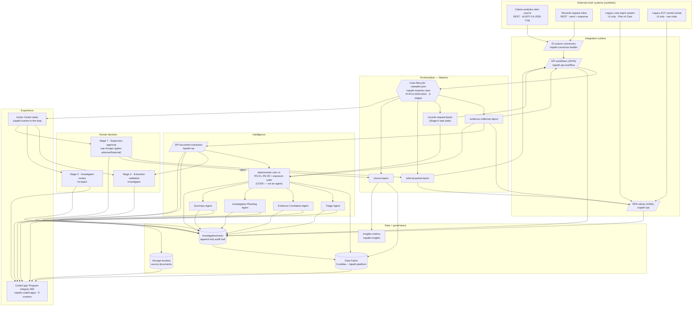

# 01 — Architecture — Program Integrity 360

*Authored per `/uipath-planner`. End-to-end architecture for the Medicaid Personal Care Services (PCS)
program-integrity investigation demo. Single case **PI-PCS-2026-0041**, Harbor Home Support Services,
attendant Jordan Ellis (`ATT-2087`). **Synthetic data only** — no real person, provider, member, or claim.*

> **Read `../CANON.md` first.** It is the single source of truth for every ID, date, and number.
> If anything here disagrees with CANON, CANON wins.

## Positioning (the architectural thesis)

Program Integrity 360 **identifies risk signals, organizes evidence, and routes decisions to humans.**
It never makes a fraud determination. The architecture enforces three hard boundaries at design time:

1. **Deterministic code — not agents — does all arithmetic** (overlaps, unit overages, unsupported
   units, threshold breaches, exposure math). The engine is `deterministic-calc-v1`.
2. **Agents explain and organize.** They reference deterministic values by ID, separate FACT (cited)
   from INFERENCE (suggested, for human review), and never re-score or decide.
3. **Humans decide.** Every adverse or financial action is gated behind an explicit human approval,
   and any adverse/financial disposition additionally requires **supervisor** approval (Stage 7).

Every mutation appends one immutable `InvestigationAction` row, so the case carries a complete audit
trail from alert to closure.

---

## 1. Component diagram (alert → closure)

**Read the flow as:** an alert lands via the IS connector and an API workflow opens the case; the
Maestro case drives four deterministic BPMN subprocesses; evidence is pulled (RPA + API), documents are
extracted (IXP), and **code** computes the five risk signals and the exposure range; agents explain and
organize the deterministic outputs; humans validate and decide through Action Center tasks surfaced in
the coded app; approved actions execute and the case closes with a watch-list flag and Insights metrics.
Every step writes an `InvestigationAction`.

---

## 2. Layer view

| Layer | Responsibility | Components | Skills |
|---|---|---|---|
| **Experience** | Investigator/supervisor UI + task inbox | Coded app (9 screens), Action Center tasks | `/uipath-coded-apps`, `/uipath-human-in-the-loop` |
| **Orchestration** | Case lifecycle, stage gates, wait state, deterministic subprocesses | `caseplan.json` (9 stages), 4 `.bpmn` subprocesses | `/uipath-maestro-case`, `/uipath-maestro-bpmn` |
| **Automation** | Move data in/out of legacy + modern systems | RPA robots (legacy UI), API workflows (modern REST + outbound), IS connectors (mock endpoints) | `/uipath-rpa`, `/uipath-api-workflow`, `/uipath-connector-builder` |
| **Intelligence** | Read documents; compute signals; explain/organize | IXP extraction, `deterministic-calc-v1`, 4 grounded agents | `/uipath-ixp`, `/uipath-agents` |
| **Data** | System of record + evidence + audit + metrics | Data Fabric (9 entities), storage buckets, `InvestigationAction`, Insights | `/uipath-platform`, `/uipath-insights` |
| **Governance** | Packaging, least-privilege, auditability, review | Solution packaging, roles/assignments, review self-audit | `/uipath-solution`, `/uipath-platform`, `/uipath-review`, `/uipath-test` |

The **intelligence layer is deliberately split**: IXP and the four agents are probabilistic and produce
either *cited facts* (IXP) or *explanations* (agents); `deterministic-calc-v1` is the only component in
that layer that produces numbers, and it is ordinary code — auditable, reproducible, agent-free.

---

## 3. Separation of duties — DETERMINISTIC vs AGENTIC vs HUMAN

This is the core defensibility story. Each responsibility lives in exactly one column.

| Concern | DETERMINISTIC (code) | AGENTIC (explain / organize) | HUMAN (decide) |
|---|---|---|---|
| Overlap detection (RS-01) | Code: time ranges intersect > 0 min → 90-min overlap 2026-04-14 | Correlation Agent narrates *why* the overlap matters | Investigator confirms it is worth pursuing (Stage 5) |
| Manual/no-GPS rate (RS-02) | Code: 12 of 44 visits = 27.3% | Agent frames it as a method/quality flag, not proof | Investigator weighs it |
| Units over plan of care (RS-03) | Code: `units_billed > poc_daily_units` → 3 DOS, 12-unit overage | Agent groups it with the overlap day | Investigator |
| Unsupported units (RS-04) | Code: `billed > min(evv, timesheet)` → 4 claims, 24 units | Agent explains the timesheet contradictions (DOC-TS-0416/0519) | Investigator / Supervisor |
| Personnel gap (RS-05) | Code: cert lapsed 2026-03-31, 8 DOS after, 2 docs missing | Agent notes context | Investigator |
| Financial exposure | Code: 24 × $7.20 = $172.80; ~$1,600; $18K–$42K | Agent presents the range **with the non-determination disclaimer** | Supervisor validates before any recovery |
| Document facts | — (IXP extracts, code consumes) | — | Investigator validates low-confidence/sensitive extractions (Stage 3) |
| Priority = High | Code emits the deterministic signal summary | Triage Agent *explains* the priority, never re-scores | — (explanation only) |
| Next steps | — | Planning Agent *recommends only*, flags every gate | Investigator elects to proceed (Stage 5) |
| Adverse / financial disposition | Referral packet + recovery amount are computed by code | Summary Agent drafts the narrative (FACT vs INFERENCE) | **Supervisor approves or rejects (Stage 7)** |
| Execution | BPMN executes exactly what was approved | — | — |

**Rule of thumb stated on-screen:** *code does the math, agents do the words, humans do the decisions.*

---

## 4. Grounding & traceability

Nothing in this system is allowed to be an unsourced assertion. Three grounding chains hold:

- **Every agent claim → a source.** Agent output labels each statement as **FACT (cited)** — pointing to
  a document ID (`DOC-TS-0416`, `DOC-POC-33915`, …) or a deterministic value by ID (`RS-01`..`RS-05`,
  claim IDs) — or **INFERENCE (suggested, for human review)**. Agents reference deterministic values by
  ID; they never recompute them. Constraints are declared per agent in `caseplan.json`
  (e.g. Correlation Agent: *"no arithmetic; reference deterministic values by ID"*).
- **Every signal → rule + inputs.** Each `RiskSignal` row stores `rule_expression` (the exact
  deterministic rule), `inputs` (the records/values evaluated), `result_value`, `computed_by =
  deterministic-calc-v1`, and `computed_at`. RS-01 = *"1 overlap on 2026-04-14 (90 min)"* is fully
  reconstructable from its stored inputs (EVV-88231 × EVV-88237).
- **Every action → an `InvestigationAction`.** The audit policy in `caseplan.json` is append-only:
  *"Every task completion or record mutation appends one immutable InvestigationAction row."* Each row
  carries `actor`, `actor_kind` (Human / System / Agent), `timestamp`, `detail`, and
  `before_value`/`after_value` for edits. The Case Timeline screen renders this as an immutable event
  stream.

**Traceability path for any on-screen number:** on-screen value → `RiskSignal.result_value` / `Claim`
field → `rule_expression` + `inputs` → source `EVVVisit` / `Claim` / `EvidenceDocument` rows → the
`InvestigationAction` that wrote it. The Claims vs EVV Reconciliation screen shows the improper-unit
math line-by-line so a reviewer can re-derive the 24-unit total (8 + 8 + 4 + 4) by hand.

---

## 5. Security & defensibility for SLED / HHS

Public-sector program integrity work must survive appeal, audit, and public-records scrutiny. The
architecture addresses each pillar structurally, not by policy alone.

| Pillar | How the architecture meets it | Where in the repo |
|---|---|---|
| **Auditability** | Append-only `InvestigationAction` on every mutation; each signal stores rule + inputs + `computed_by` + `computed_at`; edits keep before/after. Complete chain alert→closure. | `docs/03-data-model.md` (§8), `maestro-case/caseplan.json` (`auditPolicy`), `closure.bpmn.md` |
| **Transparency** | Deterministic rules are human-readable and shown on-screen; agents label FACT vs INFERENCE with citations; exposure always paired with the non-determination disclaimer. | `CANON.md` §4–5, `ixp/ixp-taxonomy.md`, `agents/*` specs, coded-app Risk Signals & Agent Rationale screen |
| **Process control** | Fixed 9-stage lifecycle with explicit entry/exit gates; adverse/financial work cannot execute without passing the Stage 7 supervisor gate; BPMN guards abort if `Decision.approved != true`. | `caseplan.json` (stage gates + transitions), `referral-packet.bpmn.md` (approval guard) |
| **Human oversight** | Two human gates (Stage 5 investigator, Stage 7 supervisor) plus mandatory human validation of low-confidence/sensitive extractions; agents recommend only. | `hitl/human-in-the-loop.md`, `caseplan.json` (`humanGate: true`), `ixp/ixp-taxonomy.md` |
| **Data confidentiality** | Restricted/investigative work product; members referenced by initials only (R.A., T.N.); synthetic data throughout; least-privilege roles (investigator, supervisor, system). | `CANON.md` §1, `platform/*`, `caseplan.json` `roles[]` |
| **Least privilege** | Distinct roles — `inv.taylor` (investigator), `sup.morgan` (supervisor), `system` (`deterministic-calc-v1`). Only the supervisor role can approve adverse/financial dispositions; the system role never decides. | `caseplan.json` `roles[]`, `hitl/human-in-the-loop.md` |

**Confidentiality note:** the case is classified *Restricted / investigative work product*; members
appear by initials only; the provider, attendant, claims, and documents are entirely synthetic. No PHI or
PII of a real person is present anywhere in the demo.
