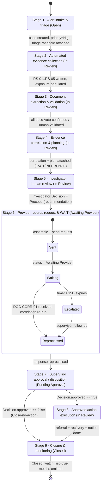

# 02 — Case Stages — Program Integrity 360

*Authored per `/uipath-maestro-case`. The nine-stage Maestro case lifecycle for **PI-PCS-2026-0041**
(Harbor Home Support Services, attendant Jordan Ellis `ATT-2087`). **Synthetic data only.***

> **Read `../CANON.md` first** (§7 is the stage source). This document expands each stage; the executable
> definition is `../maestro-case/caseplan.json` and its plan `../maestro-case/tasks.md`.

## Positioning (applies to every stage)

- The lifecycle **identifies risk signals, organizes evidence, and routes decisions to humans.** It never
  makes a fraud determination.
- **All arithmetic is deterministic** (`deterministic-calc-v1`). Agents explain and organize only.
- **Adverse or financial actions require supervisor approval** (Stage 7 human gate).
- Every task completion or record mutation appends one immutable `InvestigationAction` row.

**Roles:** `inv.taylor` (OPI Investigator), `sup.morgan` (OPI Supervisor), `system`
(Automation / `deterministic-calc-v1`).

---

## State diagram

---

## Stage 1 — Alert intake & triage  *(status: Open)*

- **Entry trigger:** inbound claims-analytics alert `ALERT-CA-2026-7781` (batch anomaly model),
  alert date 2026-07-20.
- **Actors:** `system` (intake), Triage Agent (explain-only).
- **Automations invoked:**
  - `intake-alert` — **`/uipath-api-workflow`** (`../api-workflows/api-lookups.md`): ingests the alert,
    creates `ProgramIntegrityCase` `PI-PCS-2026-0041` (status `Open`, priority `High`), seeds parties
    `PRV-100482` / `ATT-2087`, seeds `sla_due`.
  - **Triage Agent** — **`/uipath-agents`** (`../agents/triage-agent.md`): explains the High priority
    citing the deterministic signal summary. Constraints: *no re-scoring; cite deterministic signals only.*
- **Human gates:** none.
- **Inputs (Data Fabric):** alert payload. **Outputs:** `ProgramIntegrityCase` (opened);
  `InvestigationAction` (case opened).
- **Exit condition:** case record created AND `priority = High` AND triage rationale attached & grounded.
- **SLA:** 4 business hours (`sla_due`).
- **Audit rows:** `InvestigationAction` — *Case opened* (`actor = system`, `actor_kind = System`);
  triage rationale attachment (`actor = Triage Agent`, `actor_kind = Agent`).

## Stage 2 — Automated evidence collection  *(status: In Review)*

- **Entry trigger:** Stage 1 complete (case opened).
- **Actors:** `system` / `deterministic-calc-v1`.
- **Automations invoked:** `evidence-collection.bpmn` — **`/uipath-maestro-bpmn`**
  (`../maestro-bpmn/evidence-collection.bpmn.md`), which calls:
  - claims pull → **`/uipath-api-workflow`** → `Claim[]`
  - EVV + Plan of Care legacy pull → **`/uipath-rpa`** (`../rpa/legacy-pulls.md`) → `EVVVisit[]`, POC doc
  - document intake to buckets → `/uipath-rpa` + `/uipath-api-workflow` → `EvidenceDocument[]`
  - land into Data Fabric → **`/uipath-platform`**
  - deterministic calc → `RS-01..RS-05` + exposure math (`deterministic-calc-v1`)
- **Human gates:** none.
- **Inputs:** source claims / EVV / POC / documents. **Outputs:** `Claim[]`, `EVVVisit[]`,
  `EvidenceDocument[]`, `RiskSignal[]` (5 rows), populated exposure fields
  (`potential_exposure_low = 172.80`, `potential_exposure_high = 42000.00`).
- **Exit condition:** all source records landed AND `RS-01..RS-05` written (`risk_signal_count = 5`)
  AND exposure fields populated.
- **SLA:** 1 business day.
- **Audit rows:** `InvestigationAction` — *Doc extracted*/*Signal computed* per landed record and per
  signal (`actor = deterministic-calc-v1`, `actor_kind = System`).

**Signals computed here (all by code, CANON §4):** RS-01 overlap 90 min on 2026-04-14 (High); RS-02
manual/no-GPS 12 of 44 = 27.3% (Medium); RS-03 units > POC, 3 DOS / 12-unit overage (High); RS-04
unsupported units, 4 claims / 24 units (High); RS-05 personnel gap, cert lapsed 2026-03-31, 8 DOS after,
2 docs missing (Medium).

## Stage 3 — Document extraction & validation  *(status: In Review)*

- **Entry trigger:** Stage 2 complete AND documents in buckets.
- **Actors:** IXP model (`system`); investigator (`inv.taylor`) for validation.
- **Automations invoked:** IXP extraction `pcs-document-extraction` — **`/uipath-ixp`**
  (`../ixp/ixp-taxonomy.md`) over `DOC-TS-0416`, `DOC-TS-0519`, `DOC-POC-33915`, `DOC-SN-0414`,
  `DOC-PP-2087`.
- **Human gate:** **extraction validation task** — **`/uipath-human-in-the-loop`**
  (`../hitl/human-in-the-loop.md`). Confidence ≥ 0.85 auto-confirms; < 0.85 routes to the investigator;
  Personnel Packet and Correspondence are **always** human-reviewed regardless of score.
- **Inputs:** `EvidenceDocument` rows (from buckets). **Outputs:** `EvidenceDocument.extracted_fields`,
  `extraction_confidence`, `validation_status`. Key facts: `DOC-TS-0416` → 08:00–12:00 (contradicts
  CLM-0503); `DOC-TS-0519` → 08:00–13:00 (contradicts CLM-0540); `DOC-POC-33915` → 20 units/day.
- **Exit condition:** every `EvidenceDocument.validation_status` ∈ {Auto-confirmed, Human-validated}.
- **SLA:** 2 business days (human validation portion).
- **Audit rows:** `InvestigationAction` — *Doc extracted* (`actor_kind = System`); *Human validated*
  (`actor = inv.taylor`, `actor_kind = Human`, `validated_by` set).

## Stage 4 — Evidence correlation & investigation planning  *(status: In Review)*

- **Entry trigger:** Stage 3 complete (extractions validated).
- **Actors:** Evidence Correlation Agent, Investigation Planning Agent (both explain/organize only).
- **Automations invoked:**
  - **Evidence Correlation Agent** — **`/uipath-agents`** (`../agents/evidence-correlation-agent.md`):
    groups findings, explains the 2026-04-14 overlap and the timesheet/EVV mismatches. Constraints:
    *no arithmetic; reference deterministic values by ID (RS-01..RS-05).*
  - **Investigation Planning Agent** — **`/uipath-agents`**
    (`../agents/investigation-planning-agent.md`): recommends next steps. Constraints: *recommends only,
    never executes; flags every human gate.*
- **Human gates:** none (outputs staged for Stage 5).
- **Inputs:** `RiskSignal[]`, `Claim[]`, `EVVVisit[]`, validated `EvidenceDocument[]`. **Outputs:**
  correlated findings + planning recommendation, FACT/INFERENCE labeled.
- **Exit condition:** correlated findings + planning recommendation attached, FACT vs INFERENCE labeled.
- **SLA:** 4 business hours.
- **Audit rows:** `InvestigationAction` — correlation output and planning recommendation
  (`actor_kind = Agent`).

## Stage 5 — Investigator human review  *(status: In Review)*  **[HUMAN GATE — investigator]**

- **Entry trigger:** Stage 4 complete (correlation + plan ready).
- **Actors:** Summary Agent (draft); investigator `inv.taylor` (decide).
- **Automations invoked:** Decision Center screen — **`/uipath-coded-apps`** (`../coded-app/app-spec.md`);
  **Summary Agent** — **`/uipath-agents`** (`../agents/summary-agent.md`), FACT vs INFERENCE labeling,
  citations mandatory.
- **Human gate:** **investigator review task** — **`/uipath-human-in-the-loop`**, assignee `inv.taylor`:
  validate RS-01..RS-05, edit narrative, record a `Decision`
  (`decision_type = 'Proceed to records request'`, `decision_role = Investigator`,
  `adverse_or_financial = false`). This is a **recommendation**, not an adverse action.
- **Inputs:** correlation + plan + draft narrative. **Outputs:** `Decision` (Investigator);
  edited narrative.
- **Exit condition:** `Decision(decision_role = Investigator)` recorded to proceed.
- **SLA:** 3 business days.
- **Audit rows:** `InvestigationAction` — *Edit* (narrative, with before/after), *Approval*/decision
  (`actor = inv.taylor`, `actor_kind = Human`).

## Stage 6 — Provider records request & wait state  *(status: Awaiting Provider)*  **[WAIT STATE]**

- **Entry trigger:** Stage 5 investigator decided to proceed.
- **Actors:** `system` (send/intake); provider (external, sends response).
- **Automations invoked:** `records-request.bpmn` — **`/uipath-maestro-bpmn`**
  (`../maestro-bpmn/records-request.bpmn.md`): assembles + sends the request
  (**`/uipath-api-workflow`** via the records-inbox IS connector), sets case status `Awaiting Provider`
  (**`/uipath-maestro-case`**), **waits** on a receive/message event, intakes `DOC-CORR-01`, re-runs
  deterministic correlation.
- **Human gates:** none while waiting.
- **Wait state:** the case pauses on message event `provider-records-response` correlated to
  `PI-PCS-2026-0041`, expecting `DOC-CORR-01`. Boundary timer **P15D**; on expiry → escalate to
  `sup.morgan`.
- **Inputs:** investigator decision. **Outputs:** `EvidenceDocument:DOC-CORR-01`; refreshed correlation;
  `InvestigationAction` (*Request sent*, *Response received*).
- **Exit condition:** provider response `DOC-CORR-01` received AND correlation re-run (or timer expires →
  escalate).
- **SLA:** wait window **15 calendar days**; escalation on timer expiry.
- **Audit rows:** `InvestigationAction` — *Request sent* (`actor_kind = System`), *Response received*
  (`actor_kind = System`), correlation re-run.

## Stage 7 — Supervisor approval / disposition  *(status: Pending Approval)*  **[HUMAN GATE — supervisor]**

- **Entry trigger:** Stage 6 complete (response reprocessed).
- **Actors:** Summary Agent (refresh narrative); supervisor `sup.morgan` (decide).
- **Automations invoked:** Decision Center (gated) — **`/uipath-coded-apps`**; Summary Agent narrative
  refreshed with post-response facts — **`/uipath-agents`**.
- **Human gate:** **supervisor approval task** — **`/uipath-human-in-the-loop`**, assignee `sup.morgan`:
  approval **required when `Decision.adverse_or_financial == true`**. Records a `Decision`
  (`decision_role = Supervisor`, `approved = true|false`).
- **Inputs:** reprocessed case posture + refreshed narrative. **Outputs:** `Decision` (Supervisor,
  approved true/false).
- **Exit condition:** `Decision(decision_role = Supervisor).approved` resolved.
  Transitions: `approved == true` → Stage 8; `approved == false` → Stage 9 (Close-no-action).
- **SLA:** 2 business days.
- **Audit rows:** `InvestigationAction` — *Approval* (`actor = sup.morgan`, `actor_kind = Human`).

## Stage 8 — Approved action execution  *(status: In Review)*

- **Entry trigger:** Stage 7 `Decision.approved == true`.
- **Actors:** `system`.
- **Automations invoked:** `referral-packet.bpmn` — **`/uipath-maestro-bpmn`**
  (`../maestro-bpmn/referral-packet.bpmn.md`). A guard aborts to closure if the approval is not true.
  Generates the referral packet, opens an overpayment recovery record for the **24 confirmed unsupported
  units** (**`/uipath-api-workflow`** + **`/uipath-rpa`** legacy write-back), queues the provider notice.
- **Human gates:** none (executes only what the supervisor approved).
- **Inputs:** approved `Decision`. **Outputs:** referral packet; recovery record (24 units × $7.20 =
  **$172.80** reviewed-sample basis; ~$1,600 reviewed-period projection); queued provider notice.
- **Exit condition:** referral packet generated AND recovery record opened AND provider notice queued.
- **SLA:** 1 business day.
- **Audit rows:** `InvestigationAction` — *Action executed* (`actor_kind = System`).

## Stage 9 — Closure & monitoring  *(status: Closed)*

- **Entry trigger:** Stage 8 complete OR Stage 7 rejected (Close-no-action).
- **Actors:** `system`.
- **Automations invoked:** `closure.bpmn` — **`/uipath-maestro-bpmn`**
  (`../maestro-bpmn/closure.bpmn.md`): writes the final audit `InvestigationAction`, sets case
  `status = Closed`, sets `Provider.watch_list = true` (**`/uipath-platform`**), emits Insights metrics
  (**`/uipath-insights`**, `../insights/insights-spec.md`).
- **Human gates:** none.
- **Inputs:** executed actions (or rejection). **Outputs:** case `Closed`; `Provider:PRV-100482`
  `watch_list = true`; Insights metrics; final `InvestigationAction`.
- **Exit condition:** case `Closed` AND `Provider.watch_list = true` AND Insights metrics emitted.
- **SLA:** 1 business day.
- **Audit rows:** `InvestigationAction` — *final audit* (`actor_kind = System`).

---

## SLA table

| Stage | Name | Status | SLA | Basis | On expiry |
|---|---|---|---|---|---|
| 1 | Alert intake & triage | Open | PT4H (4 hrs) | business-hours | — |
| 2 | Automated evidence collection | In Review | P1D (1 day) | business-days | — |
| 3 | Document extraction & validation | In Review | P2D (2 days) | business-days | — |
| 4 | Evidence correlation & planning | In Review | PT4H (4 hrs) | business-hours | — |
| 5 | Investigator human review | In Review | P3D (3 days) | business-days | — |
| 6 | Provider records request & wait | Awaiting Provider | P15D (15 days) | calendar-days | escalate to supervisor |
| 7 | Supervisor approval / disposition | Pending Approval | P2D (2 days) | business-days | — |
| 8 | Approved action execution | In Review | P1D (1 day) | business-days | — |
| 9 | Closure & monitoring | Closed | P1D (1 day) | business-days | — |

## Human gates & wait state — summary

| Stage | Kind | Assignee | Rule |
|---|---|---|---|
| 3 | Human validation | `inv.taylor` (Investigator) | Validate low-confidence / sensitive extractions before they inform signals |
| 5 | **Human gate** | `inv.taylor` (Investigator) | Validate signals, decide to proceed (recommendation, not adverse) |
| 6 | **Wait state** | — | Case waits on provider response `DOC-CORR-01`; P15D timer escalation |
| 7 | **Human gate** | `sup.morgan` (Supervisor) | Approve any `adverse_or_financial` action before Stage 8 |

## Reject / close path

If the supervisor rejects at Stage 7 (`Decision.approved == false`), the case transitions **directly to
Stage 9** as **Close-no-action**: no referral packet, no recovery record, no provider notice. Closure
still writes the final `InvestigationAction`, sets `Provider.watch_list = true`, and emits Insights
metrics — so a rejected case is auditable and monitored exactly like an approved one.
