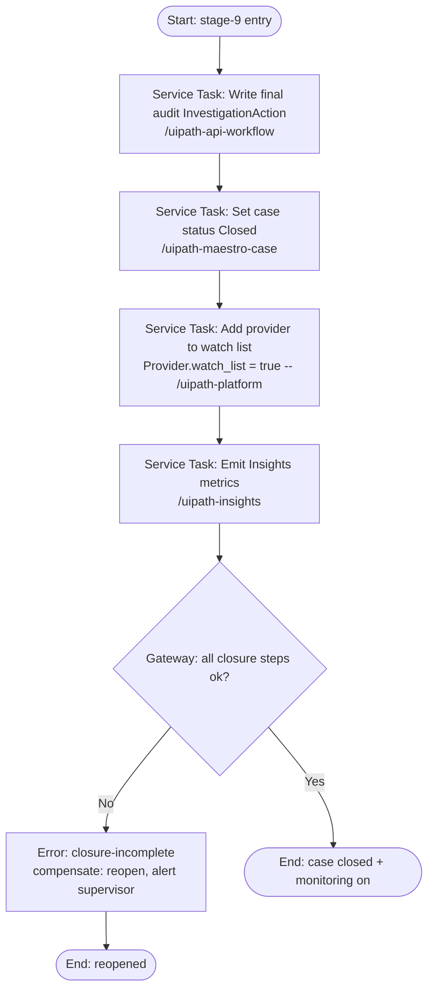

# closure.bpmn — spec

> Authored as a `/uipath-maestro-bpmn` **deterministic subprocess**. DEMO / SYNTHETIC.
> **Purpose:** Write the final audit record, close the case, add the provider to the watch list /
> monitoring, and emit Insights metrics.

**Positioning:** Closure records outcomes and starts monitoring; it makes no determination. All state
changes are appended immutably to the audit trail.

**Trigger:** Called by case stage 9 after Stage 8 execution completes, or after a Stage 7 rejection
(`Close-no-action`).

## BPMN flow

## Ordered BPMN elements

1. **Start event** — stage-9 entry.
2. **Service Task — Write final audit record** (`/uipath-api-workflow`) → terminal `InvestigationAction`.
3. **Service Task — Close case** (`/uipath-maestro-case`) → `ProgramIntegrityCase.status = Closed`.
4. **Service Task — Add provider to watch list** (`/uipath-platform`) → `Provider:PRV-100482 watch_list = true`.
5. **Service Task — Emit Insights metrics** (`/uipath-insights`).
6. **Exclusive Gateway — all closure steps ok?** (No → error/compensation).
7. **End event** — case closed and monitoring on.

## Inputs / outputs (Data Fabric entities)

- **Inputs:** `ProgramIntegrityCase` (PI-PCS-2026-0041), `Decision[]`, execution outputs from
  `referral-packet.bpmn` (if any).
- **Outputs:** terminal `InvestigationAction`, `ProgramIntegrityCase.status = Closed`,
  `Provider.watch_list = true`, emitted Insights metrics (cycle time, signals per case, exposure,
  human-gate turnaround).

## Deterministic note

Any metric aggregation emitted to Insights is computed by code (`deterministic-calc-v1`), not agents.
Closure asserts no fraud determination — it records the human-approved disposition and starts monitoring.

## Error / compensation path

- Any closure step failing the gate → **error end** `closure-incomplete`; compensation reopens the case
  (status not left as `Closed`), writes an `InvestigationAction`, and alerts `sup.morgan`. Watch-list and
  metric steps are idempotent so a retry does not double-apply.
