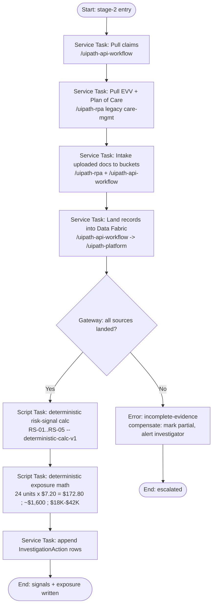

# evidence-collection.bpmn — spec

> Authored as a `/uipath-maestro-bpmn` **deterministic subprocess**. DEMO / SYNTHETIC.
> **Purpose:** Pull claims (API), EVV + Plan of Care (RPA from the legacy care-mgmt system), and
> uploaded documents into storage buckets, land everything into Data Fabric, then run the deterministic
> risk-signal calculation (RS-01..RS-05) and exposure math.

**Positioning:** This subprocess only collects evidence and runs **deterministic code**
(`deterministic-calc-v1`). It identifies risk signals; it does not make a fraud determination.
**All arithmetic here is code, never agent-computed.**

**Trigger:** Called by case stage 2 of `PI-PCS-2026-0041` after Stage 1 intake completes.

## BPMN flow

## Ordered BPMN elements

1. **Start event** — stage-2 entry (case opened).
2. **Service Task — Pull claims** (`/uipath-api-workflow`) → `Claim[]`.
3. **Service Task — Pull EVV + Plan of Care** (`/uipath-rpa`, legacy care-mgmt UI) → `EVVVisit[]`, `DOC-POC-33915`.
4. **Service Task — Intake uploaded documents to buckets** (`/uipath-rpa` portal pull + `/uipath-api-workflow`) → bucket URIs for `DOC-TS-0416`, `DOC-TS-0519`, `DOC-SN-0414`, `DOC-PP-2087`.
5. **Service Task — Land into Data Fabric** (`/uipath-api-workflow` → `/uipath-platform`).
6. **Exclusive Gateway — all sources landed?** (No → error path).
7. **Script Task — Deterministic risk-signal calc** (`deterministic-calc-v1`) → `RS-01..RS-05`.
8. **Script Task — Deterministic exposure math** → exposure range fields.
9. **Service Task — Append `InvestigationAction`** (audit).
10. **End event** — signals + exposure written (or escalated end on error).

## Inputs / outputs (Data Fabric entities)

- **Inputs:** `ProgramIntegrityCase` (PI-PCS-2026-0041), source claims feed, legacy EVV/POC, uploaded docs.
- **Outputs:** `Claim[]`, `EVVVisit[]`, `EvidenceDocument[]`, `RiskSignal[]` (5), populated exposure fields on `ProgramIntegrityCase`, `InvestigationAction[]`.

## Deterministic calculations (code, never agent)

| Signal | Rule | Result on this case | Severity |
|---|---|---|---|
| RS-01 | same attendant, two visits, time ranges intersect > 0 min | 1 overlap on 2026-04-14 (EVV-88231 x EVV-88237, 10:30–12:00 = 90 min) | High |
| RS-02 | capture_method=Manual AND gps_confirmed=No | 12 of 44 visits (27.3%) | Medium |
| RS-03 | claim.units_billed > member.poc_daily_units | 3 DOS (04-14, 04-16, 05-19), overage 12 units | High |
| RS-04 | claim.units_billed > min(evv_supported, timesheet_supported) | 4 claims, 24 unsupported units | High |
| RS-05 | cert.expiry < DOS OR required doc missing | cert lapsed 2026-03-31; 8 DOS after; 2 docs missing | Medium |

Exposure math (de-duplicated to avoid RS-03/RS-04 double-count): 24 units × $7.20 = **$172.80** (sample),
**≈ $1,600** (reviewed period projected), **$18,000 – $42,000** (provider-wide indicative, pending audit).
Every value carries the disclaimer: "Indicative range, subject to human validation. Not a determination."

## Error / compensation path

- Any source pull failing the "all sources landed?" gate → **error end event** `incomplete-evidence`;
  compensation marks the case partial, writes an `InvestigationAction`, and alerts `inv.taylor`.
  No signals are computed on partial evidence (defensibility).
