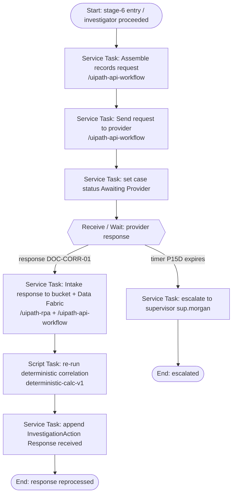

# records-request.bpmn — spec

> Authored as a `/uipath-maestro-bpmn` **deterministic subprocess**. DEMO / SYNTHETIC.
> **Purpose:** Assemble and send the provider records request, set a **wait state**, receive/intake the
> provider response (`DOC-CORR-01`), and re-run the deterministic correlation.

**Positioning:** Sending a records request is an information-gathering step, not an adverse action and
not a determination. Reprocessing on intake re-runs **deterministic code**, never agent arithmetic.

**Trigger:** Called by case stage 6 after the Stage 5 investigator decides to proceed
(`Decision.decision_type = 'Proceed to records request'`).

## BPMN flow

## Ordered BPMN elements

1. **Start event** — stage-6 entry.
2. **Service Task — Assemble records request** (`/uipath-api-workflow`) from case + attendant + claim context.
3. **Service Task — Send request** (`/uipath-api-workflow`) to the provider records channel.
4. **Service Task — Set case status `Awaiting Provider`**.
5. **Receive / Wait event — provider response** with a **timer boundary of P15D**.
6. **Service Task — Intake response** (`/uipath-rpa` inbox + `/uipath-api-workflow`) → `EvidenceDocument:DOC-CORR-01`.
7. **Script Task — Re-run deterministic correlation** (`deterministic-calc-v1`).
8. **Service Task — Append `InvestigationAction`** (`Response received`).
9. **End event** — response reprocessed (or escalated end on timer expiry).

## Wait state

- The subprocess pauses on a **message/receive event** correlated to `PI-PCS-2026-0041`, expecting
  `DOC-CORR-01` in the records-request inbox.
- **Timer boundary P15D**: on expiry, route to escalation (supervisor `sup.morgan`), not auto-close.

## Inputs / outputs (Data Fabric entities)

- **Inputs:** `ProgramIntegrityCase`, `Provider` (PRV-100482), `Claim[]`, prior `RiskSignal[]`.
- **Outputs:** `EvidenceDocument:DOC-CORR-01`, refreshed correlation view, `InvestigationAction[]`,
  case `status` transitions (`Awaiting Provider` → resolved).

## Deterministic note

Correlation re-run is `deterministic-calc-v1`. The provider response may change supported units, but any
recomputation is code; agents only explain the refreshed picture (referencing values by ID). No
determination is made here.

## Error / compensation path

- Send failure → retry (bounded), then **error end** `request-not-delivered`; compensation notifies
  `inv.taylor` and holds the case.
- Malformed / unreadable response → route to Stage 3 IXP validation before correlation re-run.
- Timer expiry → escalation to `sup.morgan`; case stays open (never silently closed).
