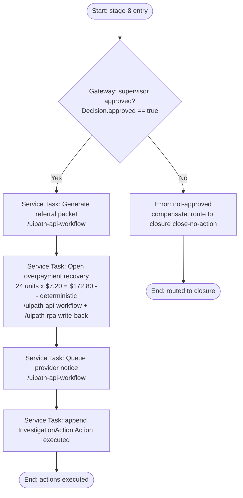

# referral-packet.bpmn — spec

> Authored as a `/uipath-maestro-bpmn` **deterministic subprocess**. DEMO / SYNTHETIC.
> **Purpose:** After **supervisor approval**, generate the referral packet, open an overpayment recovery
> record for the confirmed unsupported units (**24 units**), and queue the provider notice.

**Positioning:** This subprocess runs **only** after the Stage 7 supervisor approval gate
(`Decision.decision_role = 'Supervisor'`, `approved = true`, `adverse_or_financial = true`). It executes
the human-approved action; it does not decide, and all recovery amounts are **deterministic** code.

**Trigger:** Called by case stage 8 on supervisor approval.

## BPMN flow

## Ordered BPMN elements

1. **Start event** — stage-8 entry.
2. **Exclusive Gateway — supervisor approved?** (`Decision.approved == true`; No → abort/compensate).
3. **Service Task — Generate referral packet** (`/uipath-api-workflow`) bundling signals, evidence, and narrative.
4. **Service Task — Open overpayment recovery** (`/uipath-api-workflow` + `/uipath-rpa` legacy write-back) for **24 confirmed unsupported units**.
5. **Service Task — Queue provider notice** (`/uipath-api-workflow`).
6. **Service Task — Append `InvestigationAction`** (`Action executed`).
7. **End event** — actions executed.

## Inputs / outputs (Data Fabric entities)

- **Inputs:** `Decision` (supervisor-approved), `RiskSignal[]` (RS-01..RS-05), `Claim[]` (flagged),
  `EvidenceDocument[]`, `ProgramIntegrityCase`.
- **Outputs:** referral packet artifact (bucket URI on `EvidenceDocument`), overpayment recovery record,
  queued provider notice, `InvestigationAction[]`.

## Deterministic note

The recovery basis is fixed by code, not an agent: **24 units × $7.20 = $172.80** (reviewed-sample basis;
reviewed-period projection **≈ $1,600**; provider-wide indicative **$18,000 – $42,000** pending audit).
The packet presents these with the disclaimer "Indicative range, subject to human validation. Not a
determination." No new arithmetic is invented here — it reuses `deterministic-calc-v1` outputs.

## Error / compensation path

- Gateway `approved == false` (or missing approval) → **error end** `not-approved`; compensation routes
  the case to `closure.bpmn` as `Close-no-action`. No financial action is taken without the gate.
- Recovery write-back failure → bounded retry, then compensate: void the partial recovery record and
  alert `sup.morgan`; case is not closed until reconciled.
